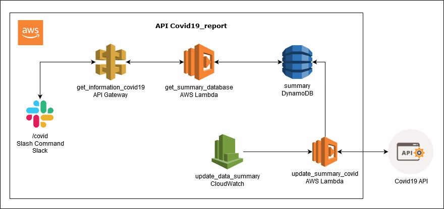

### Purpose
covid19_report is an API that get the information from https://covid19api.com/#details, it is inserted on a database and we use this information to report the numbers of deaths, recovered and infected in a country or globally using a slack bot and a slash command  

We used Python for this project.
- Version Python 3 or more

### Installation
To install the requirements

`pip install -r requirements.txt`

### Run Unit Test

You need to write this command on the terminal to run the unit test.

`python -m tests.unit_test`

### Application Architecture

##### Slash Command

* Start when Slack send the slash command.
* APIGetway receives the request and send to get_summary_database lambda function.
* Lambda function receives the request and get the information from DynamoDB.
* Lambda will answer to slack with the information.

##### Update database

* CloudWatch triggers the lambda function every  12 hrs to update the database.
* Lambda function get the information from Covid19 API and insert this information on database.
